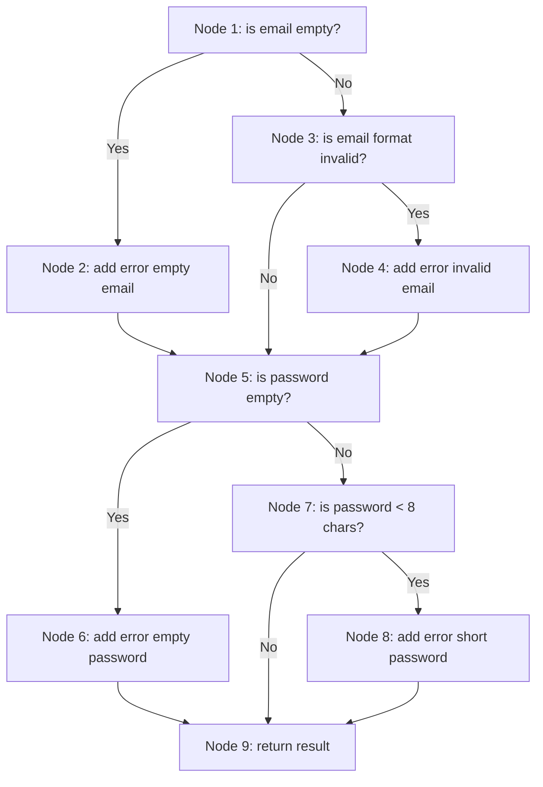

# Control Flow Graph (CFG) Analysis

Analisis CFG dilakukan untuk memahami alur eksekusi kode dan menentukan jalur pengujian (White Box Testing).

## Fungsi: `AuthValidationService::validateLoginInput`

### Source Code
```php
public function validateLoginInput(?string $email, ?string $password): array
{
    $errors = [];

    // Node 1
    if (empty($email)) {
        $errors[] = "Email wajib diisi."; // Node 2
    } else {
        // Node 3
        if (!filter_var($email, FILTER_VALIDATE_EMAIL)) {
            $errors[] = "Format email tidak valid."; // Node 4
        }
    }

    // Node 5
    if (empty($password)) {
        $errors[] = "Password wajib diisi."; // Node 6
    } else {
        // Node 7
        if (strlen($password) < 8) {
            $errors[] = "Password minimal 8 karakter."; // Node 8
        }
    }

    // Node 9
    return [
        'is_valid' => empty($errors),
        'errors' => $errors
    ];
}
```

### Control Flow Graph (Mermaid)


### Daftar Node
- **Node 1**: Decision - Pengecekan apakah email kosong.
- **Node 2**: Statement - Penambahan error "Email wajib diisi".
- **Node 3**: Decision - Pengecekan format email.
- **Node 4**: Statement - Penambahan error "Format email tidak valid".
- **Node 5**: Decision - Pengecekan apakah password kosong.
- **Node 6**: Statement - Penambahan error "Password wajib diisi".
- **Node 7**: Decision - Pengecekan panjang password.
- **Node 8**: Statement - Penambahan error "Password minimal 8 karakter".
- **Node 9**: Statement - Return hasil validasi.
