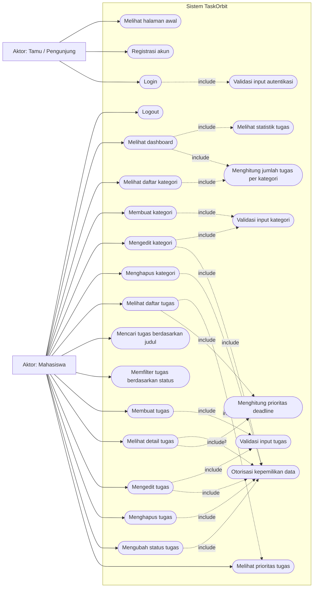
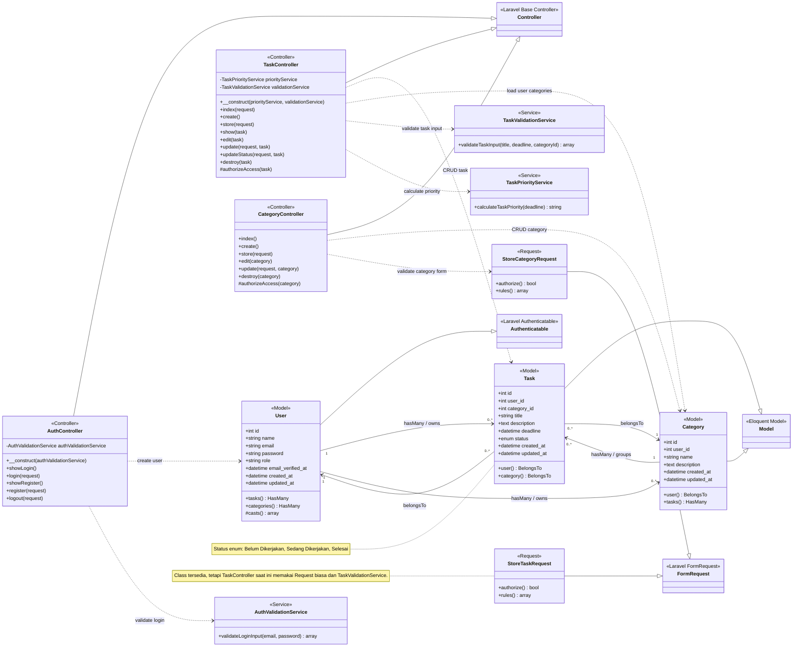
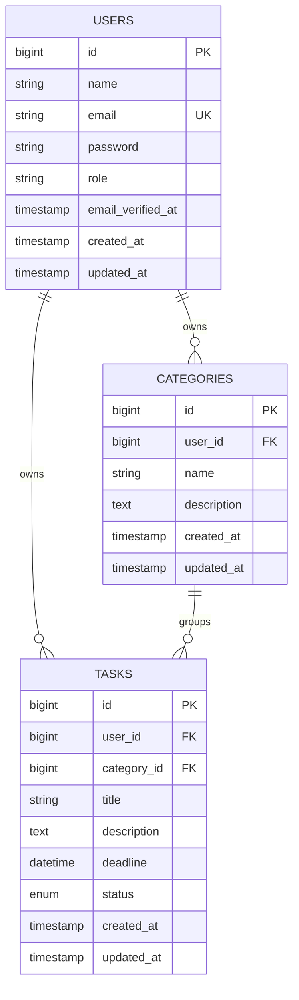

# Analisis Use Case dan Class Diagram TaskOrbit

Tanggal analisis: 2026-05-13

## Ringkasan Sistem

TaskOrbit adalah aplikasi manajemen tugas akademik berbasis Laravel. Sistem menyediakan autentikasi pengguna, dashboard statistik, pengelolaan kategori, pengelolaan tugas, pencarian dan filter tugas, perubahan status tugas, serta perhitungan prioritas tugas berdasarkan deadline.

Analisis ini disusun dari kode pada:

- `routes/web.php`
- `app/Http/Controllers/AuthController.php`
- `app/Http/Controllers/TaskController.php`
- `app/Http/Controllers/CategoryController.php`
- `app/Models/User.php`
- `app/Models/Task.php`
- `app/Models/Category.php`
- `app/Services/AuthValidationService.php`
- `app/Services/TaskValidationService.php`
- `app/Services/TaskPriorityService.php`
- `app/Http/Requests/StoreCategoryRequest.php`
- `app/Http/Requests/StoreTaskRequest.php`
- `database/migrations/*users*`, `*categories*`, dan `*tasks*`
- `tests/Feature/AuthTest.php`, `TaskFeatureTest.php`, dan `CategoryFeatureTest.php`

## Use Case Diagram

## Detail Use Case

| Kode | Use case | Aktor | Route / kode utama | Prakondisi | Alur ringkas | Pascakondisi |
| --- | --- | --- | --- | --- | --- | --- |
| UC01 | Melihat halaman awal | Tamu, Mahasiswa | `GET /` | Tidak wajib login | Sistem menampilkan `welcome` | Pengguna melihat landing page |
| UC02 | Registrasi akun | Tamu | `GET /register`, `POST /register`, `AuthController@register` | Pengguna belum login | Pengguna mengisi nama, email, password, konfirmasi password | User baru dibuat dengan role default `mahasiswa`, lalu login otomatis |
| UC03 | Login | Tamu | `GET /login`, `POST /login`, `AuthController@login` | Pengguna belum login dan punya akun | Sistem memvalidasi email dan password, lalu menjalankan `Auth::attempt` | Session dibuat ulang dan pengguna diarahkan ke dashboard |
| UC04 | Logout | Mahasiswa | `POST /logout`, `AuthController@logout` | Pengguna sudah login | Sistem logout, invalidate session, regenerate token | Pengguna kembali ke halaman awal |
| UC05 | Melihat dashboard | Mahasiswa | `GET /dashboard` closure route | Pengguna sudah login | Sistem mengambil total tugas, tugas selesai, total kategori, dan distribusi status | Dashboard menampilkan ringkasan produktivitas |
| UC06 | Melihat statistik tugas | Mahasiswa | `dashboard.blade.php` + Chart.js | Ada atau tidak ada tugas | Sistem menyiapkan data status `Belum Dikerjakan`, `Sedang Dikerjakan`, `Selesai` | Chart dan angka status ditampilkan |
| UC10 | Melihat daftar kategori | Mahasiswa | `GET /categories`, `CategoryController@index` | Pengguna sudah login | Sistem mengambil kategori milik user beserta `tasks_count` | Daftar kategori tampil |
| UC11 | Membuat kategori | Mahasiswa | `GET /categories/create`, `POST /categories` | Pengguna sudah login | Pengguna mengisi nama dan deskripsi, sistem validasi `StoreCategoryRequest` | Kategori baru tersimpan untuk user login |
| UC12 | Mengedit kategori | Mahasiswa | `GET /categories/{category}/edit`, `PUT /categories/{category}` | Kategori milik user login | Sistem otorisasi kepemilikan, validasi input, lalu update kategori | Data kategori berubah |
| UC13 | Menghapus kategori | Mahasiswa | `DELETE /categories/{category}` | Kategori milik user login | Sistem otorisasi kepemilikan lalu menghapus kategori | Kategori terhapus, tugas dalam kategori ikut terhapus karena `onDelete('cascade')` |
| UC20 | Melihat daftar tugas | Mahasiswa | `GET /tasks`, `TaskController@index` | Pengguna sudah login | Sistem mengambil tugas milik user, eager load kategori, urut terbaru, pagination 10 data | Daftar tugas tampil dengan kategori, deadline, status, dan prioritas |
| UC21 | Mencari tugas berdasarkan judul | Mahasiswa | `GET /tasks?search=...` | Pengguna sudah login | Sistem menambahkan query `where title like` | Daftar tugas difilter berdasarkan kata kunci |
| UC22 | Memfilter tugas berdasarkan status | Mahasiswa | `GET /tasks?status=...` | Pengguna sudah login | Sistem menambahkan query `where status` | Daftar tugas difilter berdasarkan status |
| UC23 | Membuat tugas | Mahasiswa | `GET /tasks/create`, `POST /tasks`, `TaskController@store` | Pengguna sudah login dan memiliki kategori | Sistem memvalidasi judul, deadline, kategori melalui `TaskValidationService` | Tugas baru dibuat dengan status awal `Belum Dikerjakan` |
| UC24 | Melihat detail tugas | Mahasiswa | `GET /tasks/{task}`, `TaskController@show` | Tugas milik user login | Sistem otorisasi kepemilikan dan menghitung prioritas | Detail tugas tampil |
| UC25 | Mengedit tugas | Mahasiswa | `GET /tasks/{task}/edit`, `PUT /tasks/{task}` | Tugas milik user login | Sistem otorisasi, validasi input, lalu update tugas | Data tugas berubah |
| UC26 | Menghapus tugas | Mahasiswa | `DELETE /tasks/{task}` | Tugas milik user login | Sistem otorisasi lalu menghapus tugas | Tugas terhapus |
| UC27 | Mengubah status tugas | Mahasiswa | `PATCH /tasks/{task}/status`, `TaskController@updateStatus` | Tugas milik user login | Sistem validasi status harus salah satu dari 3 nilai enum | Status tugas diperbarui |
| UC28 | Melihat prioritas tugas | Mahasiswa | `TaskPriorityService@calculateTaskPriority` | Tugas memiliki deadline | Sistem menghitung prioritas dari deadline | Prioritas tampil sebagai `Sangat Tinggi (Overdue)`, `Tinggi`, `Medium`, `Rendah`, atau `Normal` |

## Class Diagram

## Detail Class dan Tanggung Jawab

| Class | Layer | Tanggung jawab utama | Catatan penting |
| --- | --- | --- | --- |
| `User` | Model | Menyimpan data akun dan relasi ke tugas serta kategori | Field `role` ditambahkan melalui migration dan default-nya `mahasiswa` |
| `Task` | Model | Merepresentasikan tugas akademik milik user dalam suatu kategori | `deadline` di-cast ke `datetime`; status dibatasi oleh enum pada migration |
| `Category` | Model | Merepresentasikan kelompok tugas milik user | Satu kategori dapat memiliki banyak tugas |
| `AuthController` | Controller | Menampilkan form login/register, memproses login/register/logout | Login memakai `AuthValidationService`, register memakai validasi Laravel langsung |
| `TaskController` | Controller | CRUD tugas, pencarian, filter status, update status, otorisasi kepemilikan | Data selalu diambil dari `Auth::user()->tasks()` agar scoped ke user login |
| `CategoryController` | Controller | CRUD kategori dan otorisasi kepemilikan kategori | Menggunakan `StoreCategoryRequest` untuk validasi create/update |
| `AuthValidationService` | Service | Validasi input login untuk email dan password | Mengembalikan array `is_valid` dan `errors` |
| `TaskValidationService` | Service | Validasi title, deadline, dan kategori saat create/update tugas | Dipakai langsung oleh `TaskController@store` dan `TaskController@update` |
| `TaskPriorityService` | Service | Menghitung prioritas tugas berdasarkan deadline | Menghasilkan prioritas `Sangat Tinggi (Overdue)`, `Tinggi`, `Medium`, `Rendah`, atau `Normal` |
| `StoreCategoryRequest` | Form Request | Aturan validasi kategori | `name` wajib, `description` opsional |
| `StoreTaskRequest` | Form Request | Aturan validasi tugas | Saat analisis dibuat class ini belum digunakan oleh `TaskController` |

## Relasi Data

## Catatan Desain dari Kode

- Sistem saat ini efektif memiliki satu aktor terautentikasi, yaitu `Mahasiswa`. Field `role` sudah tersedia, tetapi belum ada branching fitur untuk role lain seperti admin.
- Semua route task dan category berada di middleware `auth`; route login/register berada di middleware `guest`.
- Akses data milik user lain dicegah secara manual melalui `authorizeAccess()` pada `TaskController` dan `CategoryController`.
- Penghapusan `User` akan menghapus `Category` dan `Task` miliknya karena foreign key memakai `onDelete('cascade')`.
- Penghapusan `Category` juga akan menghapus `Task` dalam kategori tersebut karena `tasks.category_id` memakai `onDelete('cascade')`.
- Dashboard masih berupa closure di `routes/web.php`, bukan controller terpisah.
- `StoreTaskRequest` sudah ada, tetapi implementasi task saat ini memakai `Illuminate\Http\Request` dan validasi custom melalui `TaskValidationService`.
